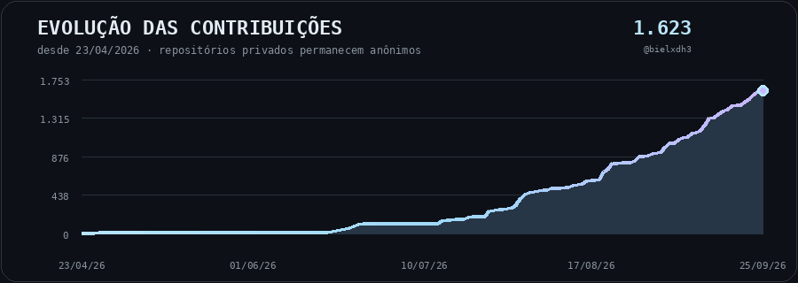

<div align="center">
  
### Construindo IA local, software experimental e ferramentas que eu gostaria que existissem.

<p>
  
</p>

<p>
       
</p>

</div>

<br>

Desenvolvo projetos principalmente em torno de **IA local, privacidade, aplicações próprias, infraestrutura self-hosted e experimentação**.

Boa parte deles nasce de uma pergunta simples:

> 🩵 **Quanto disso dá para tornar realmente nosso, local e controlável, em vez de depender de mais um serviço na nuvem?**

---

# 📈 Evolução dos commits

<p align="center">
  
</p>

<sub>Atualizado automaticamente uma vez por dia. A animação percorre o histórico desde a primeira contribuição registrada em 2026 até o total atual usando o calendário de contribuições do perfil, incluindo contribuições privadas quando o token do workflow permite, sem publicar nomes ou detalhes de repositórios privados. O SVG estático continua sendo gerado como fallback, e as atualizações automáticas são feitas por <code>github-actions[bot]</code>.</sub>

---

# 🧠 BielOS

> ### 🔒 Meu projeto principal e maior ecossistema experimental
>
> **IA · software · infraestrutura · integração de ferramentas**

O **BielOS** conecta diferentes ideias de software, IA, automação e infraestrutura em uma arquitetura maior.

É onde exploro como ferramentas independentes, agentes, serviços e componentes locais podem trabalhar juntos sem transformar tudo em uma única aplicação monolítica.

<p>
 
</p>

---

# 💯 Projetos em destaque

## 🤖 [A.I.P](https://github.com/bielxdh3/AIP)

### Agentes Independentes Personalizáveis

Plataforma local-first para agentes persistentes com identidade própria, memória, conversas, modelo e estado individual.

<p>
      
</p>

---

## ⚔️ [Prompt Arena](https://github.com/bielxdh3/Prompt-Arena)

### Benchmark reproduzível para IA local

Workspace desktop para benchmarks reproduzíveis e auditáveis, preservando configuração efetiva, outputs, hashes, histórico e evidências de avaliação. Suporta execução local com **Ollama, LM Studio e llama.cpp/GGUF**, além de provedores BYOK opcionais.

<p>
       
</p>

---

## 🌌 [Frontier Models](https://github.com/bielxdh3/Frontiers-Models)

### Benchmarks auditáveis de modelos de fronteira

Arquivo de benchmarks completos com **prompts exatos, proveniência fixada, snapshots, evidências, scorecards e comparações reproduzíveis**.

A arena **Frontier V2** compara atualmente **GPT-6 Astra Max**, **Grok 4.6 XHIGH**, **Fable 5.1 Max** e **Gemini 3.8 Flash High** sob o mesmo prompt mestre. **GPT-5.6 Sun Max V2** e **GPT-5.6 Luna Max** continuam preservados em uma seção separada como execuções históricas ou non-frontier.

<p>
    
</p>

---

## 🗄️ [Root.ark](https://github.com/bielxdh3/root.ark)

### Armazenamento e sincronização self-hosted

Sistema para gerenciamento de arquivos em rede privada com usuários, permissões, versões, compartilhamento, backups, sincronização e integrações de armazenamento.

<p>
    
</p>

---

## 🔐 [L-Vault](https://github.com/bielxdh3/L-vault)

### LocalVault Backup Manager

Cofre local para preservar, organizar, verificar e consultar backups do Gmail e arquivos exportados pelo Google Takeout.

<p>
    
</p>

---

## ⚙️ [Dual Agents](https://github.com/bielxdh3/Dual-Agents)

### Orquestração local de agentes de coding

Orquestrador local que coordena um **Codex Architect** com um **Google Antigravity/Gemini Executor**, usando delegação estruturada, ciclos de correção e revisão final pelo Architect. Contas, papéis, permissões e contextos permanecem separados.

<p>
   
</p>

---

# 🧪 Outros projetos

## 🎙 [V-Lab](https://github.com/bielxdh3/V-Lab)

### Voice Lab

Laboratório local-first para clonagem de voz, preparação de datasets, fine-tuning e experimentação com múltiplas vozes usando Qwen3-TTS.

<p>
   
</p>

---

## 💰 [deManage](https://github.com/bielxdh3/demanage)

Aplicação pessoal para gestão financeira, despesas, entradas, cartões, cofrinhos e acompanhamento do dinheiro ao longo do mês.

<p>
     
</p>

---

# 🩵 Áreas que mais me interessam

```text
IA local          █████████████████████
Self-hosting      ████████████████████
Experimentos      ███████████████████
```

Gosto especialmente de construir projetos onde **dados, estado e execução permanecem explícitos e sob controle do usuário**.

Muitos começam como experimentos pequenos e vão crescendo até virar software bem mais sério do que deveriam ter virado. 😅

---

<div align="center">


### Construindo, testando e descobrindo até onde dá para levar uma ideia.

</div>
