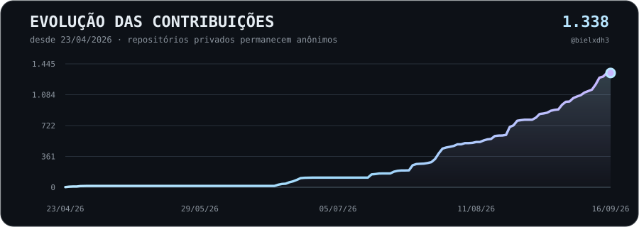

<div align="center">


### Construindo IA local, software experimental e ferramentas que eu gostaria que existissem.

<p>
   
</p>

<p>
     
</p>

</div>

<br>

Desenvolvo projetos principalmente em torno de **IA local, privacidade, aplicações próprias, infraestrutura self-hosted e experimentação**.

Boa parte deles nasce de uma pergunta simples:

> 🩵 **Quanto disso dá para tornar realmente nosso, local e controlável, em vez de depender de mais um serviço na nuvem?**

---

# 📈 Evolução dos commits

<p align="center">
  
</p>

<sub>Atualizado automaticamente uma vez por dia. O gráfico conta commits únicos de minha autoria encontrados em todas as branches acessíveis, incluindo repositórios públicos e privados, com deduplicação por SHA. Nenhum nome ou detalhe de repositório privado é publicado. Os commits da própria atualização são feitos por <code>github-actions[bot]</code>.</sub>

---

# 🧠 BielOS

> ### 🔒 Meu projeto principal e maior ecossistema experimental
>
> **IA · software · infraestrutura · integração de ferramentas**

O **BielOS** conecta diferentes ideias de software, IA, automação e infraestrutura em uma arquitetura maior.

É onde exploro como ferramentas independentes, agentes, serviços e componentes locais podem trabalhar juntos sem transformar tudo em uma única aplicação monolítica.

<p>
 
</p>

---

# 💯 Projetos em destaque

## 🤖 [A.I.P](https://github.com/bielxdh3/AIP)

### Agentes Independentes Personalizáveis

Plataforma local-first para agentes persistentes com identidade própria, memória, conversas, modelo e estado individual.

<p>
      
</p>

---

## ⚔️ [Prompt Arena](https://github.com/bielxdh3/Prompt-Arena)

### Benchmark reproduzível para IA local

Workspace desktop para criar benchmarks, executar modelos locais e preservar evidências das execuções, permitindo comparar modelos de forma inspecionável e reproduzível.

<p>
     
</p>

---

## 🗄️ [root.ark](https://github.com/bielxdh3/root.ark)

### Armazenamento e sincronização self-hosted

Sistema para gerenciamento de arquivos em rede privada com usuários, permissões, versões, compartilhamento, backups, sincronização e integrações de armazenamento.

<p>
  
</p>

---

## 🔐 [L-Vault](https://github.com/bielxdh3/L-vault)

### LocalVault Backup Manager

Cofre local para preservar, organizar, verificar e consultar backups do Gmail e arquivos exportados pelo Google Takeout.

<p>
   
</p>

---

## 🎙 [V-Lab](https://github.com/bielxdh3/V-Lab)

### Voice Lab

Laboratório local-first para clonagem de voz, preparação de datasets, fine-tuning e experimentação com múltiplas vozes usando Qwen3-TTS.

<p>
   
</p>

---

## ⚙️ [Dual Codex](https://github.com/bielxdh3/Dual-Codex)

### Orquestração local de múltiplos Codex

Ferramenta para coordenar contas Codex isoladas em diferentes funções, como Architect, Executor e Reviewer, mantendo identidades, permissões e contextos separados.

<p>
  
</p>

---

# 🧪 Outros projetos

## 💰 [deManage](https://github.com/bielxdh3/demanage)

Aplicação pessoal para gestão financeira, despesas, entradas, cartões, cofrinhos e acompanhamento do dinheiro ao longo do mês.

<p>
   
</p>

<br>

## ☀️ [GPT-5.6 SUN MAX — Solar System](https://github.com/bielxdh3/GPT5.6-SUN-MAX-SOLAR-SYSTEM)

Experiência 3D interativa do Sistema Solar para navegador, com exploração dos corpos celestes, controle da simulação e visualizações comparativas.

**Benchmark do GPT-5.6 Sol no modo max**

<p>
  
</p>

---

# 🩵 Áreas que mais me interessam

```text
IA local          █████████████████████
Self-hosting      ████████████████████
Experimentos      ███████████████████
```

Gosto especialmente de construir projetos onde **dados, estado e execução permanecem explícitos e sob controle do usuário**.

Muitos começam como experimentos pequenos e vão crescendo até virar software bem mais sério do que deveriam ter virado. 😅

---

<div align="center">


### Construindo, testando e descobrindo até onde dá para levar uma ideia.

</div>
